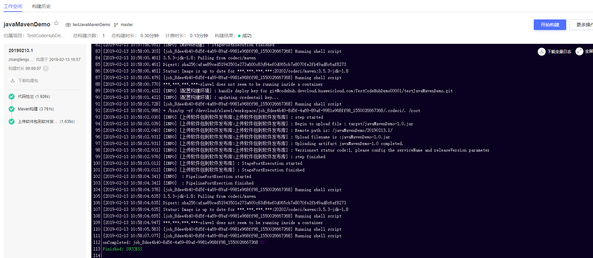
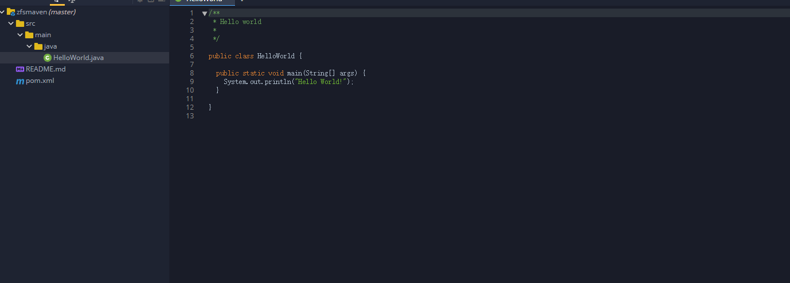
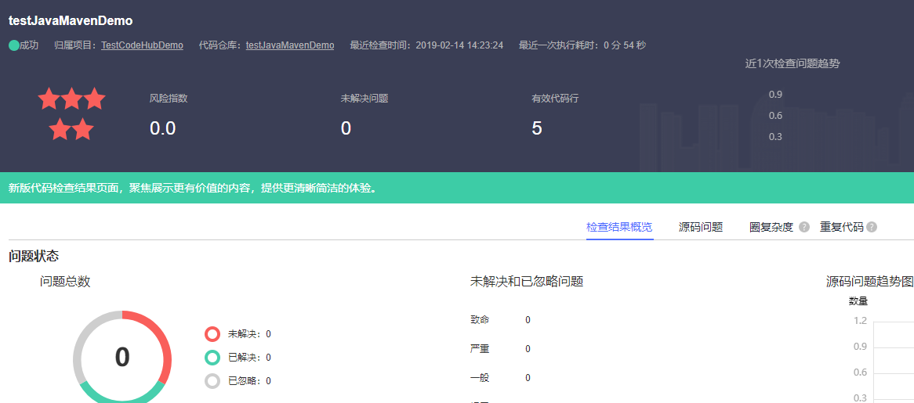

基于maven编译的Hello World小程序。
使用maven模板进行构建
使用语言 java
编译工具 maven3.5.3  jdk1.8

编译命令：mvn package -Dmaven.test.skip=true -U

* 构建结果

## 流水线相关

- 是否支持自动创建流水线：**不支持**

- 流水线配置结构

> 开始阶段
+ 源码仓库

> 编译阶段
+ 构建任务
+ 代码检查任务

> 部署阶段
+ 部署任务
+ 接口测试任务

## CloudIDE相关

- 是否支持在CloudIDE导入：**支持**

* 导入结果

## CloudCheck相关

* 检查结果

